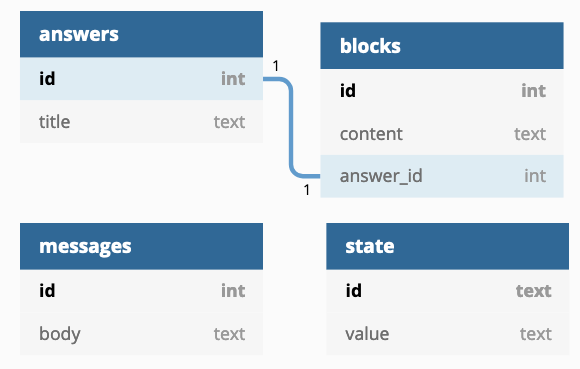

# Hello World

Welcome to the Ada Tech Hiring test! This test is designed to let you **prove** that you can program, whether you have relevant credentials or not.

This test is inspired by problems we have run into in our work and we expect you to tackle it like any other work problem. You may use any of the offered programming languages as well as your favourite editor. Feel free to google-and-stackoverflow your way to success.

As for the programming challenges, we suggest you stick to the old programming mantra:

- Make it work
- Make it right
- Make it fast

The most important thing is to make it work somehow. If you then can clean it up and make it _right_, all the better. That said, we would like you to give some thought on how you would run your code in production and express the underlying assumptions of your solution. Do you expect a dataset to fit into memory? Why? Would you change your approach if you had 100 instances running at the same time, as opposed to on one beefy server? Do you optimize for latency or simplicity in your solution? Please spare a few words to these assumptions and write them out; either directly as code comments or in a separate document.


As for the code, don't feel bound by what is already there. Add functions and datastructures as you see fit, and delete old code with abandon if you don't find it helpful (as long as the unit tests pass). This is your code, so write it your way!

# The Setup

You are working on a database-backed web-app in which you have to fix bugs and add new functionality (sounds familiar?).

The application is written in one of Python3, Node.js/Javascript, or Clojure. The choice is yours! You can find the aforementioned application in its respective folder and you can run it by executing the supplied `run.sh` script. Make sure to install the relevant libraries; we trust you know how.

The database of the application can be queried through SQL and has the following schema:



This is a simplified version of our bot schema, in which an `answer` (something that a bot says) consists of several, potentially deeply nested "blocks" (that are all stored as one big JSON blob per answer in the `blocks` table). These blocks represent functionality, such as showing text, showing images, performing HTTP requests, etc. The lower row of the diagram shows the `messages` table which show the messages that the bot has sent. Finally, `state` includes some conversation state that will be relevant in the first challenge.

Unlike in real-life there is also a test-suite that will give you instant feedback on whether your solution works or not. You can run the tests through `python3 tests/testname.py` (there is also a script that uses docker if your Python installation isn't up to date!).

# Challenge 1: Messages

The `/messages` endpoint returns all the messages in the database. Try running the application and hitting the endpoint [in your browser](http://localhost:5000/messages) or through `curl http://localhost:5000/messages` (do it now!).

Unfortunately, as you can see, the messages only show the message *template* instead of the actual message because the variable values have not been filled in! In our message template, variables are identified by `{|}`. Everything after the initial `{` and before the `|` is the variable id, and everything after the `|` but before the closing `}` is a _fallback_ value, in case there is no value for this variable.

In this application, variable values are stored in the `state` table. For example, consider the template string `Hello {asdf|planet}`. If the `state` table has a row with the id `asdf`, and value of `Earth`, then the processed message should read `Hello Earth`. If no such row exists, then the string should read `Hello planet`.

Your mission, should you choose to accept it, is to modify the `/messages` route to fill in the correct variable values into the messages so that we may all profit from the wisdom within!

You can test your result by running `python3 tests/test_messages.py`


# Challenge 2: Search
The `/search` endpoint performs a search for answers based on their titles, for example:

```sh
curl -d '{"query":"Star Trek"}' -H "Content-Type: application/json" -X POST http://localhost:5000/search
```

will result in
```js
[{
    "id": 3,
    "title": "Star Trek API"
 }]
```

Due to changing business requirements and demanding clients, you will now have to modify the endpoint to not only return the _full_ answer (including its blocks), but also allow search within the content block fields! Don't forget to _also_ search the title, and while you're at it, please make sure that the endpoint `400`s on invalid input, as is best practice. Lastly, we now also want to support searching for multiple terms that **all** have to show up **somewhere** in the answer.

You can test your solution through `tests/test_search.py`. Have a look at it too, as it will probably answer a lot of the questions you may be having.

It's possible to cheat your way into something that passes the specific test cases provided but goes against the spirit of the question. We'd rather you solve what we _mean_ and not *just* colour inside the lines that the tests provide :)

Good luck and ... _live long and prosper_ 🖖
